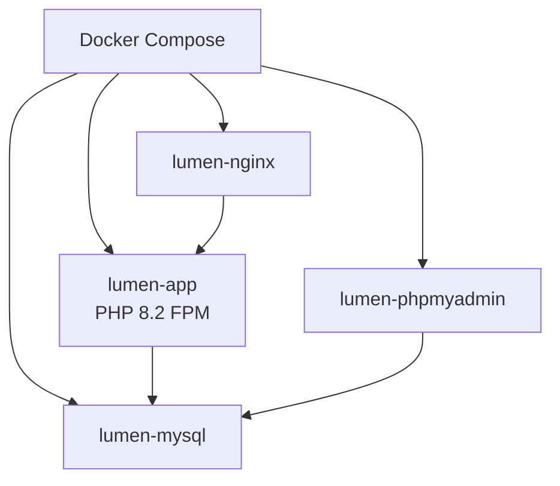
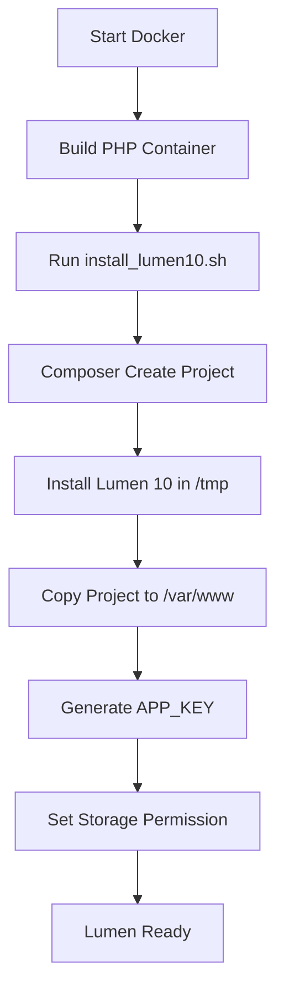
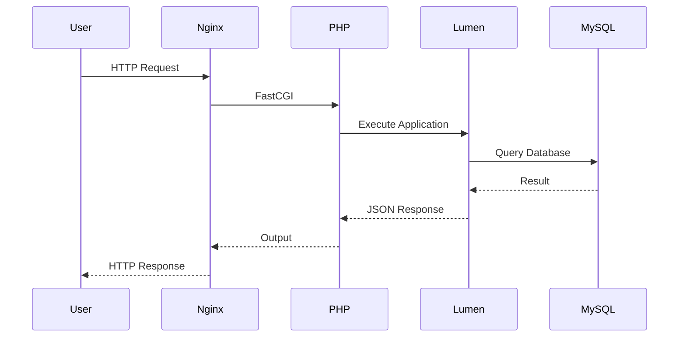
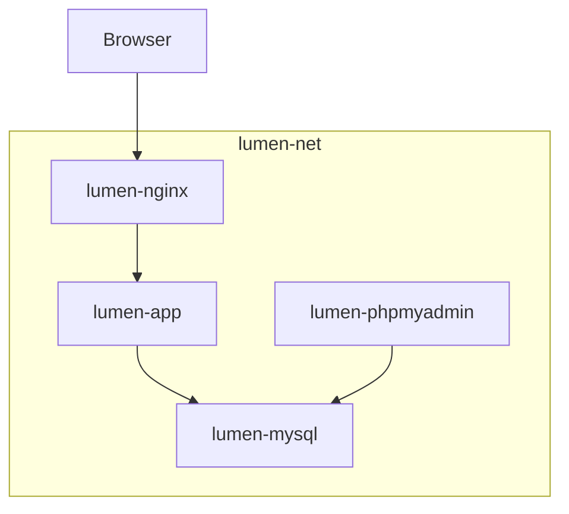
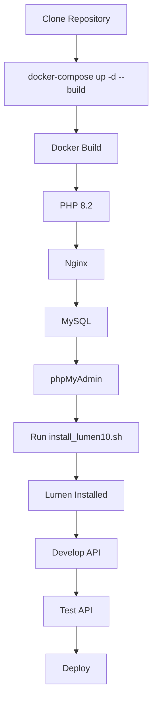

# Docker PHP Starter Kit for Lumen 10
🚀 A complete Docker development environment for Lumen 10 with automated project initialization.

A production-ready Docker starter kit for Lumen 10 featuring PHP 8.2, Nginx, MySQL 8, phpMyAdmin, and Composer. Includes automated project initialization for a fast, consistent, and hassle-free development experience.

> Build your Lumen application in minutes with a complete Docker development environment.

---

# Architecture

```mermaid
flowchart LR

Browser["Browser"]

--> Nginx["NGINX"]

--> PHP["Lumen 10<br/>PHP 8.2"]

--> DB["MySQL 8"]

phpMyAdmin["phpMyAdmin"]

--> DB

# System Architecture

```mermaid
flowchart LR

    U["Developer"] -->|Browser| NGINX["NGINX<br/>Port 8082"]

    NGINX --> PHP["PHP 8.2 FPM<br/>Lumen 10"]

    PHP --> MYSQL["MySQL 8<br/>Port 3309"]

    ADMIN["phpMyAdmin<br/>Port 9092"] --> MYSQL

    PHP --> SRC["/var/www<br/>Application Source"]

    INSTALL["install_lumen10.sh"] --> PHP

    style PHP fill:#e8f5e9
    style MYSQL fill:#fff3cd
    style NGINX fill:#e3f2fd
    style ADMIN fill:#fce4ec
```

---

# Docker Container Relationship



---

# Installation Flow



---

# HTTP Request Flow



---

# Project Bootstrap Flow

```mermaid
flowchart LR

Clone Repository

--> DockerCompose["docker-compose up -d --build"]

--> Containers["Containers Running"]

--> Install["bash install_lumen10.sh"]

--> Ready["Lumen Ready"]

--> Development["Start Development"]

--> API["Build REST API"]
```

---

# Docker Network



---

# Complete Development Workflow




---

# Why This Docker Environment?

Unlike many Docker templates, this project focuses on providing a **stable, reproducible, and cross-platform development environment**, especially for developers working on Windows with bind-mounted volumes.

By separating the installation process into a temporary Linux directory (`/tmp`) before copying the project into the mounted workspace, the setup avoids many common issues related to file permissions and Composer extraction.

---

# Key Benefits

## Fast Project Bootstrap

Create a fully functional Lumen 10 development environment in just a few minutes.

No manual installation of PHP, Composer, MySQL, or Nginx is required on the host machine.

---

## Windows Friendly

One of the biggest challenges when using Docker Desktop on Windows is Composer performance and permission issues.

This repository solves that problem by installing Lumen inside the Linux container before synchronizing it to the mounted directory.

Benefits include:

* Faster installation
* Stable Composer execution
* No missing vendor packages
* Fewer permission errors

---

## Isolated Development Environment

Every dependency runs inside Docker containers.

This means:

* No PHP version conflicts
* No Composer conflicts
* No MySQL conflicts
* No local environment pollution

Each project can have its own isolated stack.

---

## Ready for API Development

The environment is optimized for:

* REST API
* JWT Authentication
* OAuth
* AWS SDK
* OCR Services
* Queue Workers
* Microservices

---

## Easy to Customize

Need another project?

Simply modify:

* Container names
* Database credentials
* Network name
* Exposed ports

without changing the overall architecture.

---

## Reproducible Environment

Every developer on the team uses exactly the same versions of:

* PHP
* Composer
* MySQL
* Nginx

This eliminates the classic "works on my machine" problem.

---

## Developer Friendly

Useful built-in services include:

* MySQL 8
* phpMyAdmin
* Nginx
* PHP-FPM
* Composer

Everything is managed through Docker Compose.

---

# Advantages Compared to Traditional Local Installation

| Traditional Setup         | Docker Environment |
| ------------------------- | ------------------ |
| Install PHP manually      | Included           |
| Install Composer manually | Included           |
| Install MySQL manually    | Included           |
| Install Nginx manually    | Included           |
| PHP version conflicts     | None               |
| MySQL version conflicts   | None               |
| Easy team collaboration   | ✅                 |
| One-command deployment    | ✅                 |
| Cross-platform            | ✅                 |
| Isolated environment      | ✅                 |

---

# Overall Workflow

```
Clone Repository
        │
        ▼
docker-compose up -d --build
        │
        ▼
Run install_lumen10.sh
        │
        ▼
Lumen Installed
        │
        ▼
Start Development
        │
        ▼
Build API
        │
        ▼
Deploy
```
